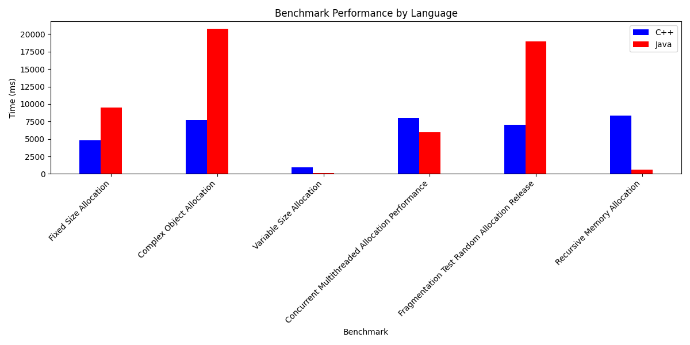

# Benchmark for performance testing of C++ and Java memory managers

This repository contains a set of benchmarks that are identical in both languages for testing the performance of C++ and Java memory managers. Benchmarks are configured via the benchmarks_config.txt configuration file and random input data is generated by the dataGen.py script.

## Requirements

Before you start, make sure you have the following tools installed.

In brackets are the versions on which I built all this, so everything works exactly on them:
- **C++ Clang compiler** (18.1.3)
- **Java SDK** (JDK21)
- **Gradle** (8.12) for building the Java part of the project
- **CMake** (3.31.5) for building the C++ part of the project
- **Python** (3.12.1 or higher, will not affect the benchmark results) for generating input data files

## Installation Benchmarks
### Step 1: Clone a repository
```bash
git clone https://github.com/lopata29435/Comparison-of-Java-vs.-C-Memory-Management-Performance-Benchmarks.git
cd Comparison-of-Java-vs.-C-Memory-Management-Performance-Benchmarks/
```
### Step 2: Build Makefile
```bash
make build
```

## Running benchmarks

### Step 1: Preparing the configuration file
Benchmarks are managed through a configuration file. This file defines the parameters for each benchmark.

below is the structure of the file, #mutable is labelled with the fields to be changed
```ini
[Fixed_Size_Allocation]
iterations= #mutable
allocation_size= #mutable

[Complex_Object_Allocation]
iterations= #mutable
element_count= #mutable

[Variable_Size_Allocation]
sizes_length= #mutable
allocation_sizes_file=../../data/AllocatorBench/allocation_sizes.txt

[Concurrent_Multithreaded_Allocation_Performance]
sizes_length= #mutable
allocation_sizes_file=../../data/AllocatorThreadBench/allocation_sizes.txt
threads_num= #mutable

[Fragmentation_Test_Random_Allocation_Release]
sizes_length= #mutable
allocation_sizes_file=../../data/MemoryFragmentationBench/allocation_sizes.txt
free_patterns_file=../../data/MemoryFragmentationBench/free_patterns.txt

[Recursive_Memory_Allocation]
depth= #mutable
allocation_size= #mutable
```

### Step 2: Generate input data files

The benchmarks require input data files such as allocation_sizes.txt, access_indices.txt, and free_patterns.txt. These files contain random values that simulate different memory allocation sizes, access patterns, and memory fragmentation.

Use the provided Python script to generate these files based on the configuration file. The script will automatically create the necessary directories and populate the files with random data.

Run the Python script:
```bash
python3 dataGen.py
```
You can also specify the --max-power parameter. This parameter sets the limit of the maximum size of allocated memory in randomly generated data. If for example --max-power 10, the maximum size will be 2^10 bytes. default value is 12. I strongly advise against making this value greater than 20.
```bash
python3 dataGen.py --max-power 10
```

### Step 3: Run benchmarks
```bash
make run
```

## Configuration File Details
The configuration file (benchmark_config.txt) defines the parameters for each benchmark. Below is an explanation of the various sections and their options:

### Fixed Size Allocation
- **iterations**: The number of iterations for the benchmark. Each iteration performs a memory allocation.
- **allocation_size**: The size of memory allocated in each iteration (in bytes).

### Complex Object Allocation 
- **iterations**: The number of iterations for the benchmark.
- **element_count**: The number of complex objects (such as structures or classes) to be allocated in each iteration.

### Variable Size Allocation
- **sizes_length**: The number of memory allocation sizes to generate.
- **allocation_sizes_file**: Path to the file containing the memory allocation sizes for the benchmark (generated by a Python script).

### Concurrent Multithreaded Allocation Performance
- **sizes_length**: Number of memory allocation sizes to generate.
- **allocation_sizes_file**: Path to the file containing the memory allocation sizes for the benchmark.
- **threads_num**: The number of threads for the multitasking memory allocation benchmark.

### Fragmentation Test: Random Allocation & Release
- **sizes_length**: Number of memory allocation sizes to generate.
- **allocation_sizes_file**: Path to the file containing the memory allocation sizes for the benchmark.
- **free_patterns_file**: Path to the file containing the memory freeing patterns (random values 0 or 1) for the fragmentation simulation.

### Recursive Memory Allocation
- **depth**: Recursive memory allocation depth.
- **allocation_size**: The size of memory allocated at each recursion level (in bytes).

## Description of benchmark scenarios

### Fixed Size Allocation
Benchmark to measure the performance of fixed-size memory allocation. Each iteration performs memory allocation of the specified size. Malloc is used for allocation.

### Complex Object Allocation
Benchmark for allocating memory for complex objects with a specified number of elements. Each iteration allocates memory for a complex object the specified number of iterations. A complex object is a class with a field containing a vector of the specified size.

### Variable Size Allocation
Benchmark for testing memory allocation using different sizes. The sizes to be allocated are generated in a Python script and passed to the benchmark via a file.

### Concurrent Multithreaded Allocation Performance
Benchmark for multitasking memory allocation testing. Uses several threads to simulate real multitasking conditions, each of which allocates memory of different sizes.

### Fragmentation Test: Random Allocation & Release
Benchmark for simulating memory fragmentation. Includes testing of memory allocation and release with different sizes and random memory release patterns.


### Recursive Memory Allocation
Benchmark for testing recursive memory allocation. Each iteration performs recursive memory allocation with specified depth and size at each level.

## Latest Benchmarks results:
| Benchmark | C++ | Java | Units |
|-----------|------|------|-------|
| Fixed Size Allocation | 4784.15 | 9462.7754 | ms |
| Complex Object Allocation | 7713.28 | 20774.1422 | ms |
| Variable Size Allocation | 955.549 | 157.153 | ms |
| Concurrent Multithreaded Allocation Performance | 7984.73 | 5980.4542 | ms |
| Fragmentation Test Random Allocation Release | 7028.75 | 18977.6814 | ms |
| Recursive Memory Allocation | 8355.95 | 616.0121 | ms |

