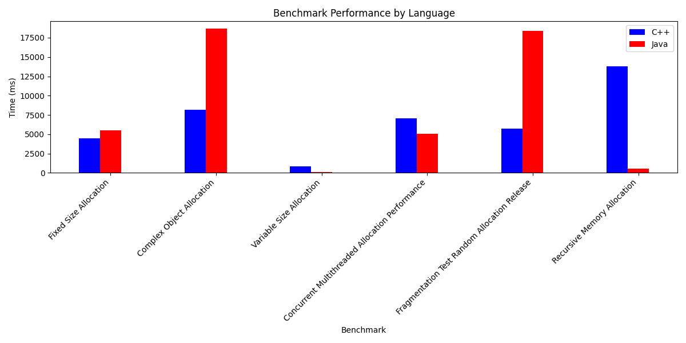

# Бенчмарк для тестирования производительности менеджеров памяти C++ и Java

Этот репозиторий содержит набор идентичных бенчмарков на обоих языках для тестирования производительности менеджеров памяти C++ и Java. Бенчмарки настраиваются через файл конфигурации benchmarks_config.txt, а случайные входные данные генерируются скриптом dataGen.py.

> en [Читать это на английском](README.md)

> en [Читать исследование](Study_en.pdf)

> ru [Читать исследование](Study_ru.pdf)

## Требования

Перед началом убедитесь, что у вас установлены следующие инструменты.

В скобках указаны версии, на которых всё было протестировано:
- **Компилятор C++ Clang** (18.1.3)
- **Java SDK** (JDK21)
- **Gradle** (8.12) для сборки Java-части проекта
- **CMake** (3.31.5) для сборки C++-части проекта
- **Python** (3.12.1 или новее, не влияет на результаты бенчмарков) для генерации входных данных

## Установка бенчмарков
### Шаг 1: Клонирование репозитория
```bash
git clone https://github.com/lopata29435/Comparison-of-Java-vs.-C-Memory-Management-Performance-Benchmarks.git
cd Comparison-of-Java-vs.-C-Memory-Management-Performance-Benchmarks/
```
### Шаг 2: Сборка проекта
```bash
make build
```

## Запуск бенчмарков
### Шаг 1: Настройка конфигурационного файла
Бенчмарки управляются через конфигурационный файл. Ниже структура файла (поля с пометкой #mutable можно изменять):
```ini
[Fixed_Size_Allocation]
iterations= #mutable
allocation_size= #mutable

[Complex_Object_Allocation]
iterations= #mutable
element_count= #mutable

[Variable_Size_Allocation]
sizes_length= #mutable
allocation_sizes_file=../../data/AllocatorBench/allocation_sizes.txt

[Concurrent_Multithreaded_Allocation_Performance]
sizes_length= #mutable
allocation_sizes_file=../../data/AllocatorThreadBench/allocation_sizes.txt
threads_num= #mutable

[Fragmentation_Test_Random_Allocation_Release]
sizes_length= #mutable
allocation_sizes_file=../../data/MemoryFragmentationBench/allocation_sizes.txt
free_patterns_file=../../data/MemoryFragmentationBench/free_patterns.txt

[Recursive_Memory_Allocation]
depth= #mutable
allocation_size= #mutable
```

### Шаг 2: Генерация входных данных
Бенчмарки требуют файлы с входными данными (например, allocation_sizes.txt, access_indices.txt, free_patterns.txt). Эти файлы содержат случайные значения для симуляции различных сценариев.

Запустите Python-скрипт:
```python
python3 dataGen.py
```
Можно указать параметр --max-power (максимальный размер выделяемой памяти в виде степени двойки). По умолчанию 12. Не рекомендуется ставить больше 20.
```python
python3 dataGen.py --max-power 10
```
### Шаг 3: Запуск бенчмарков
```bash
make run
```

## Описание бенчмарков
### Fixed Size Allocation
Тестирование выделения памяти фиксированного размера. Используется malloc.

### Complex Object Allocation
Тестирование выделения памяти для сложных объектов (классов с векторами).

### Variable Size Allocation
Тестирование выделения памяти разных размеров (размеры генерируются скриптом).

### Concurrent Multithreaded Allocation Performance
Многопоточное тестирование выделения памяти.

### Fragmentation Test: Random Allocation & Release
Тестирование фрагментации памяти (случайное выделение и освобождение).

### Recursive Memory Allocation
Рекурсивное выделение памяти с заданной глубиной.

## Последние результаты:
| Бенчмарк | C++ (мс) | Java (мс) | % Быстрее (Java vs C++) |
|-----------|-----------|-----------|--------------------------|
| Fixed Size Allocation | 4502.77 | 5536.21 | -22.95% |
| Complex Object Allocation | 8162.08 | 18685.64 | -128.93% |
| Variable Size Allocation | 822.81 | 145.69 | 82.29% |
| Concurrent Multithreaded Allocation Performance | 7088.08 | 5099.10 | 28.06% |
| Fragmentation Test Random Allocation Release | 5738.97 | 18361.38 | -219.94% |
| Recursive Memory Allocation | 13808.80 | 526.73 | 96.19% |


